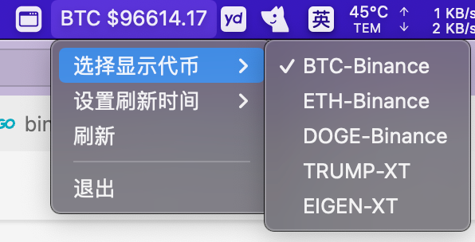

## 简介
mac顶部菜单栏展示加密货币实时价格。

效果图: 

## 快速入门
1. 安装golang开发环境
```bash
brew install golang
```
2. 下载项目
```bash
git clone https://github.com/xueyuanl/crypto-price-mac-menu.git
```
3. 运行项目
```bash
cd crypto-price

go run .

# 如果网络受限，支持启用代理
PROXY_URL=http://127.0.0.1:7890 go run .

# 默认配置文件为~/.crypto-price/config.json，可按需修改。
```
